# Eriantys Board Game
[![License: MIT][license-image]][license]


Eriantys Board Game is the final test of **"Software Engineering"**, course of [Computer Science and Engineering](https://ccs-informatica.elet.polimi.it/) held at Politecnico di Milano (2021/2022).

**Teacher** Pierluigi San Pietro

**Grade** 30/30 cum Laude


## Project specification
The project consists of a Java version of the board game [Eriantys](https://www.craniocreations.it/prodotto/eriantys/), made by Cranio Creations.

The final version includes:
* initial UML diagram;
* final UML diagram, generated from the code by automated tools;
* working game implementation, which has to be rules compliant;
* source code of the implementation;
* source code of unity tests.
## Running
Once you have installed [Java SE 17](https://docs.oracle.com/en/java/javase/17/), open a terminal and go to the project deliveries/jar directory. Once there, execute this command:
* To Run the server
```bash
java -jar EriantysServer.jar
```
* To Run the client
```bash
java -jar EriantysClient.jar
```

* You'll have to choose if you want to launch a CLI client or a GUI client by typing the option number on your keyboard.
* In order to play, you'll have to launch at least one server and two clients.

## Implemented Functionalities
| Functionality                |                                                                        Status                                                                        |
|:-----------------------------|:----------------------------------------------------------------------------------------------------------------------------------------------------:|
| Basic Rules                  |         [✅](https://github.com/riccardoinghilleri/ing-sw-2022-Inghilleri-Maftei-Merlo/tree/main/src/main/java/it/polimi/ingsw/server/model)          |
| Complete Rules               |         [✅](https://github.com/riccardoinghilleri/ing-sw-2022-Inghilleri-Maftei-Merlo/tree/main/src/main/java/it/polimi/ingsw/server/model)          |
| Socket                       |            [✅](https://github.com/riccardoinghilleri/ing-sw-2022-Inghilleri-Maftei-Merlo/tree/main/src/main/java/it/polimi/ingsw/server)             |
| CLI                          |        [✅](https://github.com/riccardoinghilleri/ing-sw-2022-Inghilleri-Maftei-Merlo/blob/main/src/main/java/it/polimi/ingsw/client/Cli.java)        |
| GUI                          |          [✅](https://github.com/riccardoinghilleri/ing-sw-2022-Inghilleri-Maftei-Merlo/blob/main/src/main/java/it/polimi/ingsw/client/gui)           |
| 12 Character Cards           | [✅](https://github.com/riccardoinghilleri/ing-sw-2022-Inghilleri-Maftei-Merlo/blob/main/src/main/java/it/polimi/ingsw/server/model/BoardExpert.java) |
| 4 Players Mode               |         [✅](https://github.com/riccardoinghilleri/ing-sw-2022-Inghilleri-Maftei-Merlo/tree/main/src/main/java/it/polimi/ingsw/server/model)          |
| Multiple Games               |            [✅](https://github.com/riccardoinghilleri/ing-sw-2022-Inghilleri-Maftei-Merlo/tree/main/src/main/java/it/polimi/ingsw/server)             |
| Persistence                  |                                                                        [⛔]()                                                                         |
| Resilience to Disconnections |                                                                        [⛔]()                                                                         |

#### Legend
[⛔]() Not Implemented &nbsp;<!--&nbsp;&nbsp;&nbsp;[⚠️]() Implementing&nbsp;-->&nbsp;&nbsp;&nbsp;[✅]() Implemented

## Test cases
All tests in model and controller has a classes' coverage at 100%.


| Package    | Classes      |    Methods     | Lines          |
|:-----------|:-------------|:--------------:|:---------------|
| Model      | 100% (17/17) | 100% (137/137) | 100% (484/484) |
| Controller | 100% (15/15) |  100% (55/55)  | 92% (363/394)  |


## The Team
* [Riccardo Inghilleri](https://github.com/riccardoinghilleri)
* [Laura Daniela Maftei](https://github.com/Daniela0610)
* [Manuela Merlo](https://github.com/ManuMerlo)

## Software used
**Draw.io** - UML diagrams and sequence diagrams

**Intellij IDEA Ultimate** - main IDE

## Photos
### CLI

- Assistant card choice
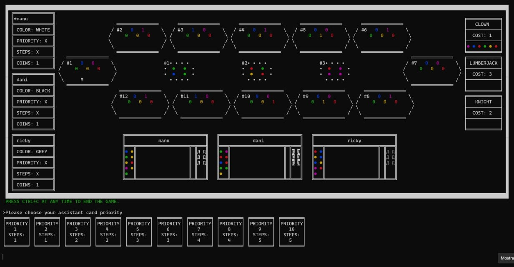 

- Tower
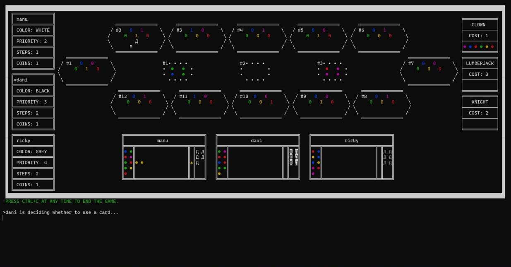 

### GUI 

- Welcome<div >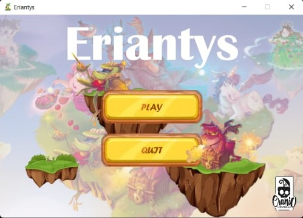</div>

- Connection<div>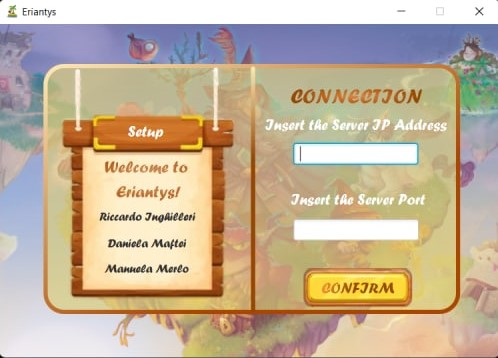</div>

- Setup Player <div> 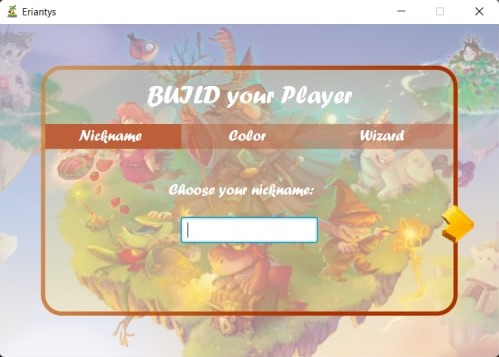 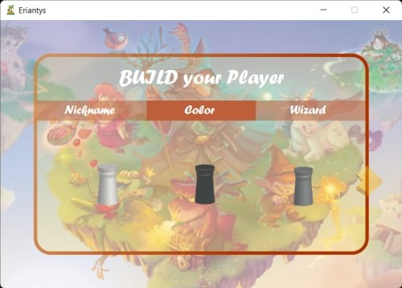 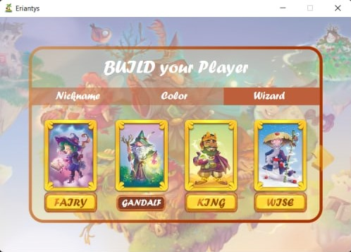 </div>

- Assistant card choice <div> 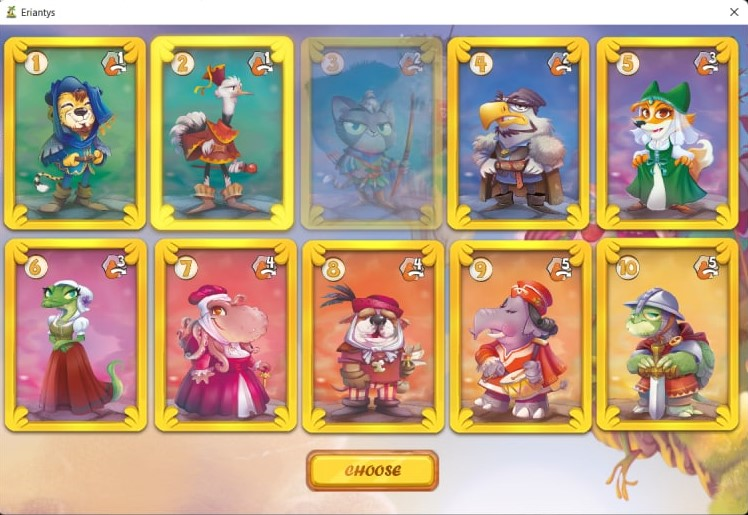 </div>

- Board<div>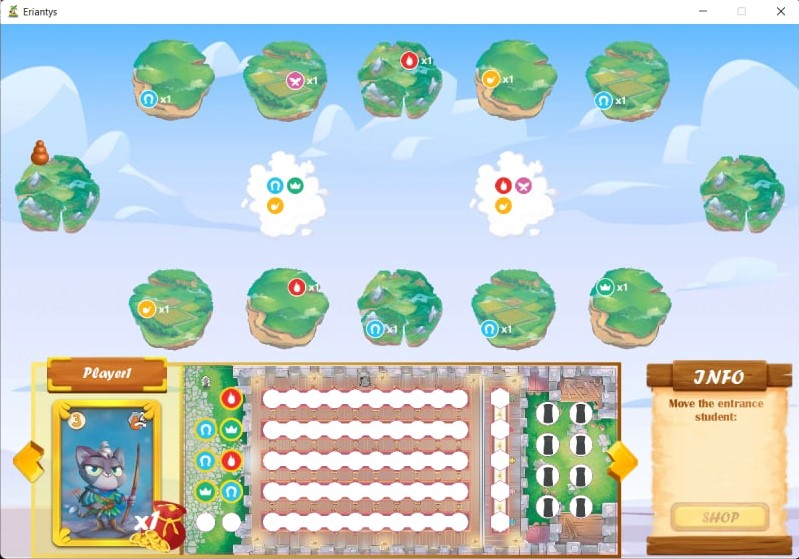
</div>

- Tower <div>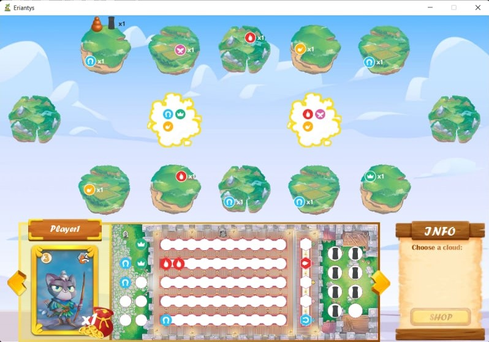
</div>

- Shop <div>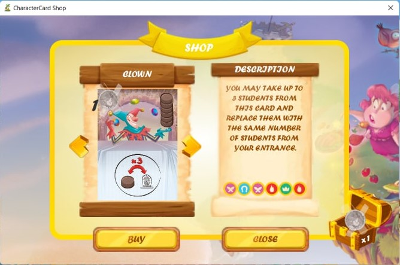
</div>


## Copyright and license

Eriantys Board Game is copyrighted 2022.

Licensed under the **[MIT License](https://github.com/riccardoinghilleri/ing-sw-2022-inghilleri-maftei-merlo/blob/main/LICENSE)**;
you may not use this software except in compliance with the License.

[license]: https://github.com/riccardoinghilleri/ing-sw-2022-inghilleri-maftei-merlo/blob/main/LICENSE
[license-image]: https://img.shields.io/badge/License-MIT-blue.svg
